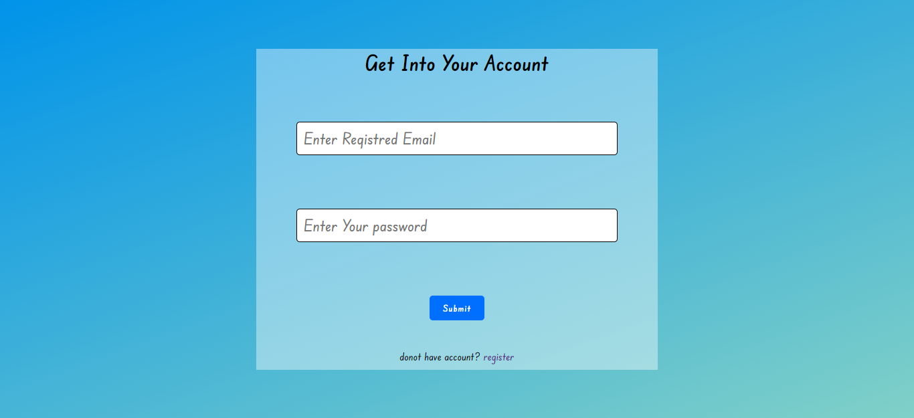
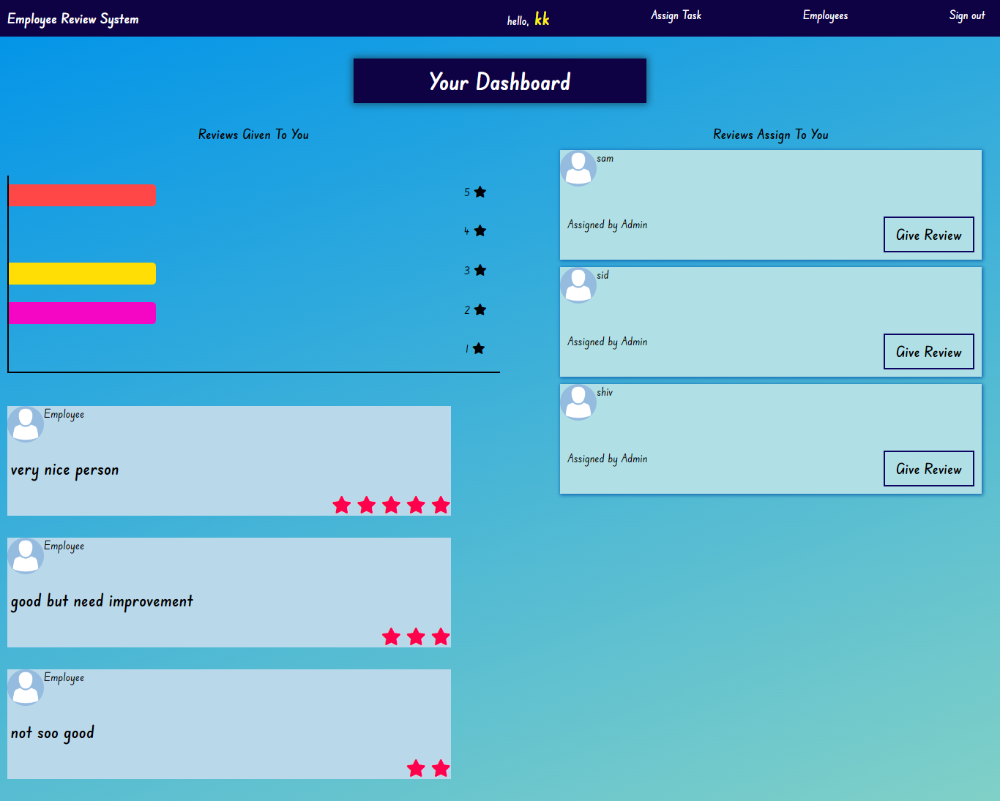
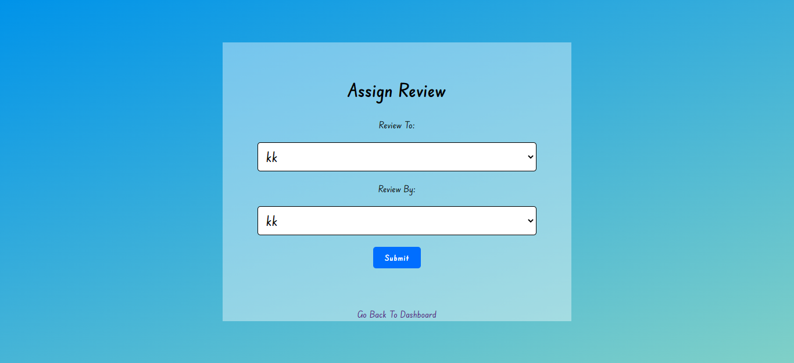
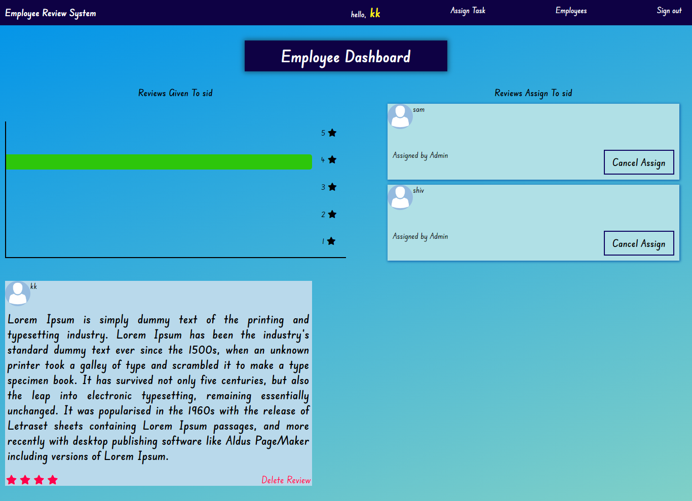
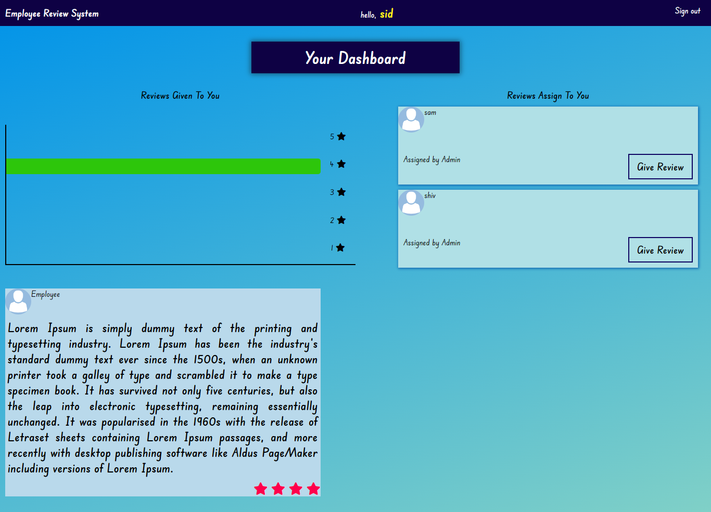

# EmployeeReviewSystem

<h2>Requirements</h2>

Create an application that allows employees to submit feedback toward each other's performance

<h2>Features</h2>
<ul>
<li>Sigin/Signup</li>
<li>Admin view<ul>
<li>Add/remove/update/view employees</li>
<li>Add/update/view performance reviews</li>
<li>Assign employees to participate in another employee's performance review</li></ul>
</li>
<li>Employee view<ul>
<li>List of performance review requiring feedback</li>
<li>Submit feedback</li></ul> </li>
<li>An employee can register, only admin can make an employee an admin</li></ul>
<h2>Admin Credentials</h2>
<ul>
  <li>E-Mail : kk@gmail.com</li>
  <li>Password: 1</li>
  <li>For employee you can create by using signup feature</li>
</ul>
<h2> SignIn</h2>
 
 
<h2> SignUP</h2>
 
 
<h2> Admin Views </h2>
 

ADMIN HOMEPAGE

 

ASSIGNTASK

 

EMOPLYEE-DASHBAORD

 
<h2> Employee Views </h2>
 

### Technologies Stack:

<ul>
  <li><a href="https://code.visualstudio.com/">Vs Code </a>- awesome web-based text editor </li>
  <li><a href="https://nodejs.org/en//">node.js </a>- evented I/O for the backend </li>
  <li><a href="https://expressjs.com/">Express </a>- fast web framework for node.js </li>
  <li><a href="https://www.mongodb.com/">mongoDB </a>- the database for modern applications </li>
  <li><a href="http://www.passportjs.org/">Passport </a>- For Authentication purpose </li>
  <li>etc </li>
</ul>

### Modules Used:

"connect-mongo": "^4.6.0",
"ejs": "^3.1.8",
"express": "^4.18.1",
"express-ejs-layouts": "^2.5.1",
"express-session": "^1.17.3",
"mongoose": "^6.5.0",
"nodemon": "^2.0.19",
"passport": "^0.6.0",
"passport-local": "^1.0.0"

### How to Install :

Clone the project onto your local machine.

Run 'npm install' to install required dependencies.

Create .env file on root directory and set given below two variable with own values:

SCERET_KEY = <YOUR_SECRET_KEY>

MONGODB_URI= <MONGODB_URL>

Run 'npm start' to start the application.

then Visit the application at http://localhost:8000
